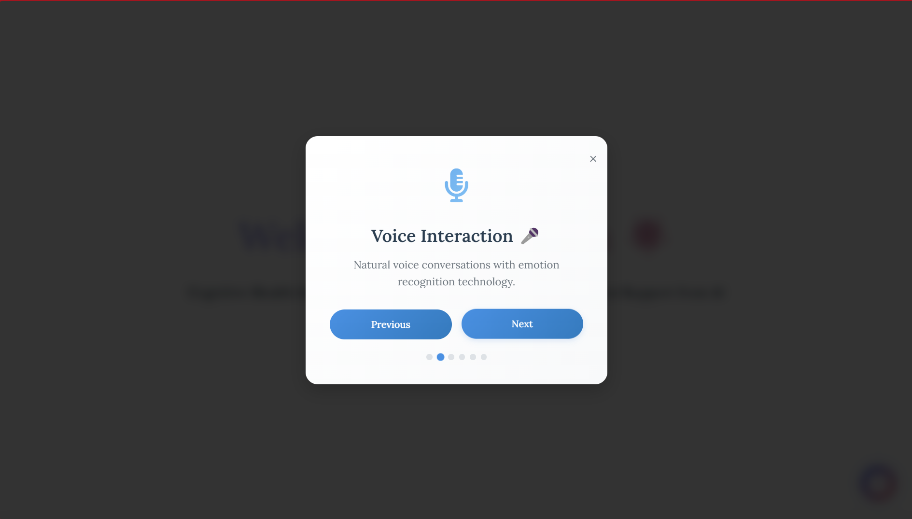
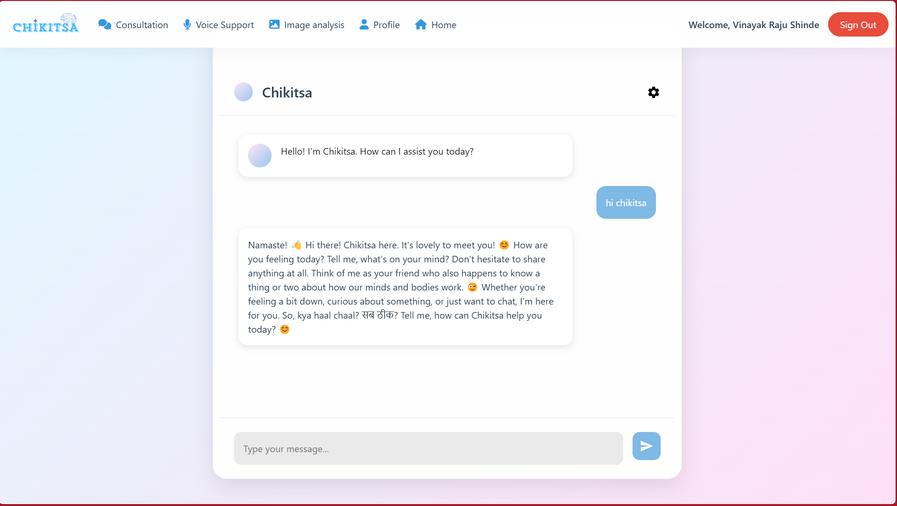
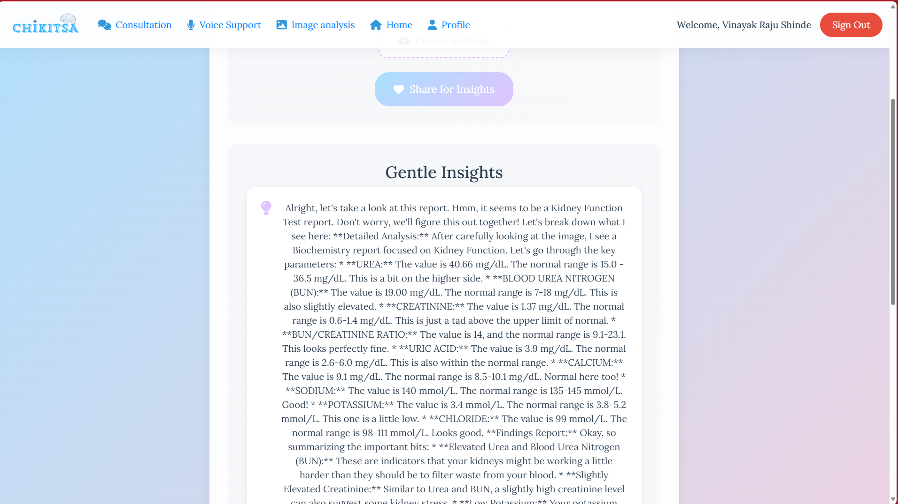

<div align="center">


# 🧠 Chikitsa v2.0

> **Cognitive Health Intelligence Knowledge with Keen Interactive Treatment Support from AI**

[](https://meity.gov.in/)
[](https://exchange.googledevelopers.com/)
[](https://smarthealthit.org/)
[](https://chikitsa.io)

*"Mind's Power, Tech's Devotion – Strength for All, A True Solution!"*
</div>

## 📋 Table of Contents

- [Overview](#-overview)
- [The Mental Health Crisis](#-the-mental-health-crisis)
- [Our Solution](#-our-solution)
- [Key Features](#-key-features)
- [Technology Stack](#-technology-stack)
- [Project Architecture](#-project-architecture)
- [Impact Assessment](#-impact-assessment)
- [SMART on FHIR Integration](#-smart-on-fhir-integration)
- [Current Status](#-current-status)
- [Team](#-team)
- [Future Roadmap](#-future-roadmap)
- [Getting Started](#-getting-started)
- [Screenshots](#-screenshots)
- [Contact](#-contact)

## 🌟 Overview

**Chikitsa** is a comprehensive AI-powered mental health platform designed to bridge the gap between mental healthcare needs and available resources globally. Born from our success at the Google Gen AI Exchange Hackathon (3rd place among 38,000+ participants), Chikitsa delivers accessible, affordable, and stigma-free mental healthcare by combining artificial intelligence with human expertise.

<div align="center">
  
</div>

### The Root Causes We Address

<div align="center">
  
  
</div>

<div align="center">
  
</div>

### Mission
To democratize mental healthcare by leveraging AI-driven insights alongside scalable human intervention, making support accessible to everyone regardless of location, financial constraints, or social stigma.

<div align="center">
  
</div>

## 🔍 The Mental Health Crisis

### Global Impact

| Problem | Statistics | Economic Impact |
|---------|------------|-----------------|
| Prevalence | 1 in 8 people globally suffer from mental disorders | $1 trillion global productivity loss annually |
| Indian Context | Over 200 million Indians affected | $14 billion annual productivity loss in India |
| Common Conditions | 29.7% depression, 67.3% anxiety (WHO data) | 80% of Indian employees report workplace stress |

### Key Barriers

| Barrier | Impact | Chikitsa's Solution |
|---------|--------|---------------------|
| **Access** | Only 0.75 psychiatrists per 100,000 in India; 15% lack local professionals | 24/7 AI support with no geographic limitations |
| **Cost** | 15% cannot afford traditional care | Free tier (₹0) with affordable scaling (up to ₹1,000/month) |
| **Stigma** | 25% hesitate to seek help; 20% prefer anonymity | Private, anonymous interactions |
| **Detection** | Delayed diagnosis worsens conditions | AI-powered predictive analytics for early intervention |

## 💡 Our Solution

Chikitsa delivers a holistic approach to mental healthcare:

- **Accessible**: Available 24/7 through AI support without geographic restrictions
- **Affordable**: Tiered pricing from free (₹0) to premium (₹1,000/month)
- **Private**: Anonymous interactions to reduce stigma
- **Proactive**: Predictive analytics for early detection of mental health concerns
- **Integrated**: SMART on FHIR compatibility with MeldRx for seamless healthcare system integration

Our platform has been validated by 50+ beta users with 100% satisfaction and selected by MeitY Startup Hub India.

<div align="center">
  
</div>

## ✨ Key Features

### 1. AI-Driven Consultations
- **Chat & Voice Interface** (`/chat`, `/talk_to_me`)
- **Gemini AI-powered** psychiatrist model
- **Bhagavad Gita wisdom** integration for resilience-building
- **Adaptive tone** based on FER emotion detection

<div align="center">
  
  
</div>

### 2. Mood Tracking & Analytics
- **Daily emotion logging** via `/mood_tracker`
- **Pattern recognition** for early risk detection
- **Visual analytics** for mood trends

<div align="center">
  
</div>

### 3. Guided Meditation
- **Mindfulness sessions** with adjustable duration (`/meditation`)
- **Progress tracking** and completion statistics
- **Gita-inspired** universal prompts

<div align="center">
  
  
</div>

### 4. Medical Image Analysis
- **Scan interpretation** using OpenCV and Gemini AI Vision
- **Anomaly detection** in medical images
- **Structured reports** for healthcare providers

<div align="center">
  
  
</div>

### 5. Live Doctor Consultations
- **Video call scheduling** (up to 4 monthly)
- **Appointment management** with doctor approval
- **Email reminders** for upcoming sessions

### 6. Comprehensive Dashboards
- **Doctor Dashboard**: Patient insights and progress tracking
- **Admin Dashboard**: User management and system administration
- **User Dashboard**: Personalized wellness journey

<div align="center">
  
</div>

### 7. AI-Generated Wellness Reports
- **Psychiatric summaries** based on user data
- **Personalized insights** and recommendations
- **Shareable reports** for healthcare providers

<div align="center">
  
  
</div>

### 8. Structured Mental Health Assessment
- **Closed-ended questionnaires** for standardized assessment
- **Open-ended responses** for qualitative insights
- **Comprehensive evaluation** for personalized care plans

<div align="center">
  
  
</div>

### 9. SMART on FHIR Integration
- **Healthcare interoperability** via MeldRx
- **EHR compatibility** with FHIR R4 standards
- **Secure authentication** using PKCE

### 10. B2B Wellness Solutions
- **Corporate wellness programs** (₹207-₹332/employee)
- **Organizational insights** for workplace mental health
- **Reduced absenteeism** and improved productivity

<div align="center">
  
</div>
<br>

## 💻 Technology Stack

| Component | Technologies |
|-----------|-------------|
| **Backend** | Flask (Python) |
| **AI & ML** | Gemini 2.0 (Google Generative AI), FER (Facial Expression Recognition), MTCNN |
| **Image Processing** | OpenCV |
| **Real-time Communication** | Flask-SocketIO |
| **Data Storage** | JSON files (transitioning to FHIR R4) |
| **Security** | Bcrypt, PKCE+OAuth2 |
| **Frontend** | HTML, CSS, Jinja2 templates |
| **Communication** | Flask-Mail |
| **Healthcare Integration** | FHIR (`fhirclient` library) |


## 🔗 MELDRX Integration

<table>
  <tr>
    <td>
      
    </td>
    <td>
      <h4>EHR Integration Features:</h4>
      <ul>
        <li>✅ SMART on FHIR compliant</li>
        <li>✅ Secure patient data exchange</li>
        <li>✅ Real-time EHR updates</li>
        <li>✅ Standardized medical records</li>
      </ul>
    </td>
  </tr>
</table>


### Integration Flow
1. **Authentication**: OAuth 2.0 with SMART launch context
2. **Data Exchange**: HL7 FHIR R4 resources
3. **Synchronization**: Real-time updates to EHR
4. **Compliance**: HIPAA and HITECH standards

| FHIR Resource | Purpose |
|--------------|---------|
| Patient | Demographics and identifiers |
| Observation | Mental health assessments |
| CarePlan | Treatment recommendations |
| Encounter | Session documentation |
### Key Algorithms

- **Predictive AI**: NLP and sentiment analysis for risk prediction
- **Emotion Detection**: Deep learning (MTCNN) for facial emotion classification (95% accuracy)
- **Image Analysis**: Computer vision with Gemini AI for health indicator detection

## 🏗️ Project Architecture

```
├── app.py                  # Main Flask application
├── templates/              # Jinja2 HTML templates
├── static/                 # Static assets
│   ├── css/                # Stylesheets
│   ├── js/                 # JavaScript files
│   └── images/             # UI screenshots and diagrams
├── dataset/
│   └── intents.json        # AI conversation intents
├── models/                 # AI model configurations
├── utils/                  # Helper functions
│   ├── emotion_detection.py  # FER implementation
│   ├── gemini_ai.py        # Gemini API integration
│   └── fhir_client.py      # SMART on FHIR client
└── config.py               # Application configuration
```

## 📊 Impact Assessment

### Target Issues vs. Solutions

| Issue Addressed | Chikitsa's Impact | Measurement |
|-----------------|-------------------|-------------|
| **Access Limitations** | 24/7 AI support bypasses professional shortage | 15% barrier reduction |
| **Stigma & Privacy** | Anonymous interactions | Addresses 25% hesitancy |
| **Cost Barriers** | Free tier and affordable plans | Tackles 15% affordability gap |
| **Early Detection** | Predictive AI and mood tracking | Catches early signs of depression (29.7%) and anxiety (67.3%) |
| **Workplace Stress** | B2B wellness solutions | Reduces $14B productivity loss in India |

## 🔄 SMART on FHIR Integration

Chikitsa leverages the SMART on FHIR framework to integrate seamlessly with healthcare systems:

- **Registration**: Patient app on app.meldrx.com (`client_id: 462ef5aa1efc4eb1b69d517846a6f65a`)
- **FHIR Mapping**: 
  - Mood data → Observation resources (`code: 80384-7`)
  - Questionnaires → QuestionnaireResponse resources
- **Authentication**: PKCE flow (`/launch`, `/callback`) for secure token exchange
- **Data Exchange**: Flask routes using `fhirclient` to fetch/store FHIR data

## 🚀 Current Status

- **Prototype**: Built during Google Hackathon (Sept-Nov 2024)
- **MVP**: Enhanced with FHIR integration for MeldRx Predictive AI App Challenge (March 2025)
- **Validation**: 50+ beta users with 100% satisfaction
- **Recognition**: 
  - 3rd place at Google Gen AI Exchange Hackathon
  - Selected by MeitY Startup Hub
  - Invited to Google Delhi event

## 👥 Team

| Member | Role | Background |
|--------|------|------------|
| **Vinayak Shinde** | Implementation Lead | ML expertise, Engagely.ai intern |
| **Vishal Misra** | Co-founder | Tech contributor, Engagely.ai intern |
| **Prof. Tushar Ghorpade** | Advisor | Academic guidance, DY Patil RAIT |

## 🔮 Future Roadmap

| Timeline | Milestone | Details |
|----------|-----------|---------|
| **Q2 2025** | Multilingual Support | 15+ Indian languages |
| **Q3 2025** | Enhanced Video Integration | Seamless telehealth capabilities |
| **Q4 2025** | Full FHIR Adoption | Complete healthcare interoperability |
| **2026** | International Expansion | Targeting global mental health markets |
| **3-Year Goal** | 200,000 Users | Significant impact on India's $14B mental health burden |

## 🚦 Getting Started

### Prerequisites
- Python 3.8+
- Flask
- Google AI Studio API key
- MeldRx developer account (for FHIR integration)

### Installation

```bash
# Clone the repository
git clone https://github.com/vinayak1729-web/chikitsa.git
cd chikitsa

# Create virtual environment
python -m venv venv
source venv/bin/activate  # On Windows: venv\Scripts\activate

# Install dependencies
pip install -r requirements.txt

# Set environment variables
export GOOGLE_API_KEY=your_api_key
export MELDRX_CLIENT_ID=your_client_id

# Run the application
python app.py
```

### Configuration
Edit `config.py` to set your application credentials and preferences.

## 📸 Screenshots

<table>
  <tr>
    <td></td>
    <td></td>
    <td></td>
  </tr>
  <tr>
    <td></td>
    <td></td>
    <td></td>
  </tr>
  <tr>
    <td></td>
    <td></td>
    <td></td>
  </tr>
</table>

## 📞 Contact

For questions, partnerships, or support, please reach out:
- **Email**: team.surya.prabha@gmail.com

---

*Chikitsa v2.0 - Healing minds with AI and human expertise*

© 2025 Chikitsa. All rights reserved.
